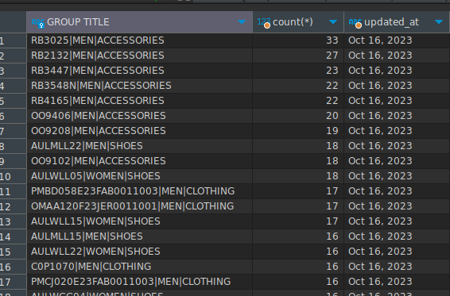

### Installation command
- Install docker for mysql - you can google how to
- Install Dbeaver for easier data analysis
- Download Baltini dataset
- `sudo docker run -d -p 3306:3306 -v ${PWD}/data:/var/lib/mysql --name mysql -e MYSQL_ROOT_PASSWORD=root -e MYSQL_DATABASE=dummy_baltini mysql:latest`
- `sudo docker exec -i mysql sh -c 'exec mysql -uroot -proot -D dummy_baltini' < 127-0-0-1dummy_baltini20231206-12-23.sql`
- For daily, just put the code inside cron job or any orchestrator, code can already accept DATE as environment variable
- run `python create_merger_list.py` to create files to be loaded
- run `python load_data.py` to load the generated data
- Use the `result_query.sql` to generate result

The result_query.sql should produce something similar to this

I temporarily used this date `2023-10-16` for reproducibility

python=3.12

### DATABASE
dummy_baltini

### TABLES
- brands
- product_duplicate_lists
- product_duplicates
- product_images
- product_options
- product_variant_options
- product_variants
- products <- we use this
- retailers
- seasons
- suppliers
